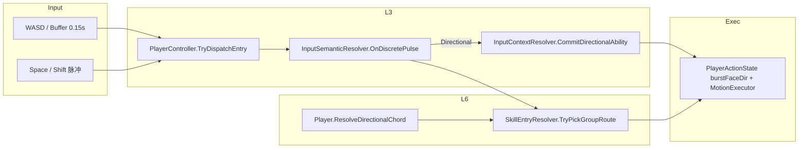

> 产出时间：2026-07-06 20:00

# 213.1 八向输入 — 位移方向异常 & Shift 容错失败 · 系统性分析

## 0. 现象复述

| # | 操作 | 期望 | 实际 |
|---|------|------|------|
| A | 连续 **W+Space** | 每次按屏感八向翻滚 | 偶发位移方向与动画/直觉不符 |
| B | **D+Space**（角色背对镜头时尤甚） | 向屏幕右侧滑出 | 可能向**后**或反侧位移 |
| C | **S+Space**（角色背对镜头） | 向后翻滚 | 可能**先转身面向镜头**再后退 |
| D | **WASD+Shift** | 八向滑铲/冲刺 | 经常落成 Shift **Fallback 无方向** Route |

**设计前提（209.3 SplitFrame）**：WASD+Space/Shift **只表达输入意图 → Group 内 Route 槽位**；位移方向应由各 Route 的 MotionProfile + MotionSpace 在资产层定好，运行时不再「二次解读 WASD」。

---

## 1. 诊断通道（本落位）

**开关**：`GameMain → Debug → Log Settings → Directional Input Diag (213.1)`  
**Console 过滤**：`[DirInput213]`

单脉冲（`pulse#N`）全链路阶段：

| STAGE | 含义 |
|-------|------|
| `BUFFER` | ModifierBuffer 年龄 / buffered vs liveMove |
| `DISPATCH` | Space/Shift 脉冲入口 |
| `SEMANTIC` | Directional vs Tap（是否进八向） |
| `COMMIT` | InputContext 锁定的 Motion 前向 |
| `MODE` | Chord vs Motion（holdDur 双模式） |
| `PICK` | Group / inputFrame / motionBasis / Route |
| `PLAY` | Action 开始时 burstFaceDir / ActionYaw |
| `WARN=*` | 自动判定的断层（见 §5） |

---

## 2. 数据流（单轨）



**关键分裂点**：`PICK`（按 stick 选 Route 槽）与 `PLAY`（按 MotionSpace + commit/burst 做位移）是**两条正交轴**——209.3 设计上如此，但若资产与运行时 Commit 仍绑 `LogicForward`，就会出现「动画对了、位移错了」。

---

## 3. 病根 A — Route 槽 ≠ Motion 基底（主因 · 背对镜头必现）

### 3.1 机制

| 分轨 | 当前 C1 Group 典型配置 | 实际行为 |
|------|------------------------|----------|
| **输入分轨** | `DirectionalInputFrame.BodyFixed` | D → **Right 槽**（与角色朝向无关，屏感 stick） |
| **位移分轨** | `MotionCurveBasisOverride = CharacterForward` | 曲线局部 +Z/+X 相对 **commit 的 LogicForward** |

`CommitDirectionalInputContext()` 传入 `Player.Forward`（即 **LogicForward**），在 Chord 窗内写入 `_committedPlanarForward`：

```258:263:3_Gameplay/Characters/Player/Core/Player.cs
    public void CommitDirectionalInputContext()
    {
        ...
        m_inputContext.CommitDirectionalAbility(Forward, holdDur, chordWin);
```

`ResolveMotionPlanarForward(CharacterForward)` 优先读该 commit：

```202:210:3_Gameplay/Characters/Player/Core/Player.cs
    public Vector3 ResolveMotionPlanarForward(MotionSpace space)
    {
        if (space == MotionSpace.CharacterForward
            && m_inputContext.TryGetDirectionalMotionForward(out var ctxForward))
        {
            return ctxForward;
        }
```

### 3.2 背对镜头时的几何

- 角色 **LogicForward ≈ 远离相机**
- BodyFixed：**D → Right 槽**（要播右翻滚 anim）
- Motion：**Right 槽曲线 +X** = 「角色自身右侧」≈ **屏幕左侧**
- 玩家体感：「D 应该往屏幕右」→ 实际位移像**往后/往反侧**

**S+Space** 同理：Backward 槽 + CharacterForward 基底；若 Action 配了 **ActionYaw**，表现层会先拧 `LogicForward`（`PLAY` 阶段 `WARN=ACTION_YAW`），出现「先转过来面向屏幕再退」。

### 3.3 与 208.1 / 212.1 的关系

- **208.1** 修的是 `captured@MoveDown` 与 live 漂移（松 W 后 D+Space）。
- **212.1** 修的是连续 W+Space 的 **hold 计时 / ContextClear**（212.2 preserveMoveHold）。
- **均未消除** 209.3 下 **BodyFixed 选槽 + CharacterForward 位移** 的结构性正交裂缝——背对镜头时 D/S 仍会「槽对、位移错」。

### 3.4 结论（问题 1）

> **不是 Motion 资产「没定好坐标系」，而是运行时 Motion 基底仍绑 LogicForward/Commit，与 BodyFixed 屏感选槽未在同一参考系。**

WASD 在 L6 只选了 Route；L7 位移仍用另一套前向 → **违反玩家对「屏感八向」的单轴心智**。

---

## 4. 病根 B — 连续 W+Space / 改键不抬手（212.2 副作用）

### 4.1 机制

`ClearDirectionalActionContext` 在翻滚结束若 WASD 仍按住 → **保留 `_moveActiveSince`**（212.2）：

```190:206:2_Framework/Input/InputContextResolver.cs
    public void ClearDirectionalActionContext(...)
    {
        ...
        var preserveMoveHold = liveMoveInput.sqrMagnitude > moveDeadZone * moveDeadZone;
        ...
        if (!preserveMoveHold)
        {
            _moveActive = false;
        }
```

`DirectionalDualModeResolver`：`holdDur > chordWin` → **Motion 模式** → 强制 `MotionForwardRoute`（沿 LogicForward 的前冲），**忽略当前 pulse 的 WASD 八向槽**。

### 4.2 连续 W+Space 时间线

1. 第一次 Space：`holdDur≈0` → Chord → Forward 槽 ✓  
2. 翻滚结束 W 仍按住 → `moveActiveSince` **不重置**  
3. 第二次 Space：`holdDur≫0.12s` → Motion → `MotionForwardRoute`  
4. Log：`WARN=MOTION_FORWARD_ROUTE` / `WARN=MODE_AXIS_CONFLICT`

### 4.3 改向不抬手

W 长按后改按 D **不触发新 MoveDown** → `holdDur` 从 W 起算 → 易 Motion 模式 + pulseAxis=D → **槽位与模式打架**。

### 4.4 结论（连续 W+Space）

> 212.2 解决了「第二下 Space 不吃输入」，但引入了 **hold 语义跨段累积**；与八向 Chord 预期冲突时，表现为「第二下位移怪/像前冲」。

---

## 5. 病根 C — Shift+WASD 落 Fallback（问题 2）

### 5.1 机制

Directional 语义**唯一入口**：

```242:251:2_Framework/Input/InputSemanticResolver.cs
        if (cfg.EnableDirectional && moveBufferValid && moveBuffered.sqrMagnitude > 0.0001f)
        {
            EnqueueSemantic(..., InputSemanticType.Directional, ...);
            return;
        }
        // 否则 → Tap → Group 内 neutral → FallbackRoute
```

`moveBufferValid` 来源：

1. `InputModifierBuffer.GetBufferedMove` — 仅当 **0.15s 内** `OnMove` 曾 `PushMove`
2. 否则 fallback：`liveMoveInput` 需 **当前帧** `MoveInput` 超 deadzone

```6:6:2_Framework/Input/InputModifierBuffer.cs
    public const float BufferSeconds = 0.15f;
```

### 5.2 失败典型序列

| 时序 | buffer | liveMove | 结果 |
|------|--------|----------|------|
| Shift 先于 WASD 1 帧 | 空 | 空 | `SEMANTIC=Tap` → Fallback |
| WASD 刚松手再 Shift | 过期 (>0.15s) | 空 | Fallback |
| 斜按力度 < deadzone | 空 | 空 | Fallback |
| WASD 有效 | 过期 | **有效** | `branch=liveMoveInput_fallback` → 常成功 |

Log：`WARN=NEUTRAL_FALLBACK` / `WARN=SHIFT_SEMANTIC_NEUTRAL` / `BUFFER_MISS_LIVE_OK`

### 5.3 系统 vs 手速

| 因素 | 占比 | 说明 |
|------|------|------|
| **系统设计** | 高 | 0.15s buffer + 必须先有 Directional 语义；Shift/Space 同路径，无「组合键宽限」 |
| **键盘手速** | 中 | Shift 略早于 WASD 1～2 帧即失败；机械轴连打更明显 |
| **资产** | 低 | `EnableDirectional` 已开则非配表问题 |

**结论**：不完全是「手残」，**0.15s 窗 + 无 Shift 专用 grace** 是主因；liveMove fallback 已缓解「按住同时按」场景，对「先 Shift 后 WASD」无效。

---

## 6. WARN 对照表（Play 验收）

| WARN | 含义 | 关联现象 |
|------|------|----------|
| `BODYFIXED_MOTION_ORTHOGONAL` | BodyFixed 右槽 + CharacterForward，屏感右与体轴右夹角大 | D+Space 反侧/后 |
| `COMMIT_LIVE_DRIFT` | commit 与 live LogicForward 偏差 >45° | 208.1 类漂移 |
| `MOTION_FORWARD_ROUTE` | 长 hold 走 MotionForwardRoute | 连续 W+Space 第二下 |
| `MODE_AXIS_CONFLICT` | Motion 模式但 pulse 非 Forward | 改键不抬手 |
| `ACTION_YAW` | ActionYaw 开启 | S+Space 先转身 |
| `NEUTRAL_FALLBACK` / `SHIFT_SEMANTIC_NEUTRAL` | 无 Directional 语义 | Shift Fallback |
| `BUFFER_EMPTY` | buffer/live 皆无 | 同上 |

---

## 7. 修复方向（213.2+ 建议，本单仅分析）

### 7.1 位移断层（优先）

**三选一（单轨，禁止双轨 fallback）：**

| 方案 | 做法 | 适用 |
|------|------|------|
| **A · 资产** | Dodge Group `motionCurveBasisOverride = CameraForward` | 最快验证屏感八向 |
| **B · Commit 契约** | Chord + BodyFixed：commit = `ResolveCameraRelativeWorldDirection(pulseAxis)`，与选槽同参考系 | 与 209.3 输入分轨一致 |
| **C · 输入分轨** | 改 `LogicProjected` + 确认八向映射表 | 偏 MMO 移动语义 |

**禁止**：Route 用 BodyFixed、Motion 仍默默读 LogicForward 且不改资产 — 即当前病根。

### 7.2 连续 W+Space / hold 累积

| 方案 | 说明 |
|------|------|
| **Space 脉冲重置 hold** | 每次 Space `moveActiveSince = now`（保留 moveActive） |
| **方向变化重置** | `moveBuffered` 主方向变更 → 新 MoveDown |
| **产品裁切** | 连按一律 Chord，仅「单键长按不点 Space」走 Motion |

### 7.3 Shift 容错

| 方案 | 参数建议 |
|------|----------|
| 延长 `InputModifierBuffer.BufferSeconds` | 0.15 → **0.22～0.25s**（Shift 专用或全局） |
| Shift 脉冲 **前瞻 1 帧** liveMove | Dispatch 时若 buffer 空但 `IsMoveActuated` 即将为真 — 需 Input 层支持 |
| **Chord 式宽限** | Shift Down 起 0.08s 内 WASD 并入同脉冲（与 LM+Shift 对称） |

---

## 8. Play 验收脚本（213.1）

1. 开 `Directional Input Diag (213.1)`，Console 过滤 `[DirInput213]`  
2. **背对镜头** → D+Space → 查 `BODYFIXED_MOTION_ORTHOGONAL` + `PICK dir=Right` + `PLAY burstFwd`  
3. **背对镜头** → S+Space → 查 `ACTION_YAW`  
4. **W 按住连按 Space×2** → 第二下是否 `MOTION_FORWARD_ROUTE`  
5. **D 按住 0.05s + Shift**（Shift 略早）→ 是否 `NEUTRAL_FALLBACK`  
6. **D+Shift 同时** → 应 `SEMANTIC=Directional`，无 `BUFFER_EMPTY`

---

## 9. 握手表（213.2 施工）

| 通电点 | 上游 | 下游 | 状态 | 验收 Log |
|--------|------|------|------|----------|
| Motion 基底与 BodyFixed 同系 | Commit / Group basis | MotionExecutor | **OPEN** | 无 `BODYFIXED_MOTION_ORTHOGONAL` |
| Space 脉冲 hold 重置 | InputContextResolver | ResolveDirectionalChord | **OPEN** | 连按无 `MOTION_FORWARD_ROUTE` |
| Shift buffer 加长 | InputModifierBuffer | Semantic | **OPEN** | 早按 Shift 无 `NEUTRAL_FALLBACK` |

---

## 10. 面试口述

> 八向翻滚在 209.3 拆成「输入选槽」和「位移曲线基底」两轨；C1 配了 BodyFixed + CharacterForward，运行时 Commit 又锁 LogicForward，导致背对镜头时 D 选对右翻滚动画但位移沿体轴右（屏左）。连续 W+Space 则因 212.2 保留 hold 计时，第二下掉进 MotionForwardRoute。Shift 失败主要是 0.15s 方向 buffer 与 Directional 语义门槛，不全是手速问题。
