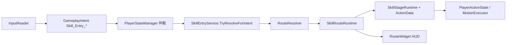

> 产出时间：2026-05-16 21:00

# Ver4.6 单轨 SkillRoute 操作指南

> **文档角色**：策划 / 程序 **日常搭技能** 的操作手册（资产编辑 + 场景接线 + 范式配方）。  
> **权威蓝图**：`6.AI/Cursor/BluePrint/Ver4.3.6_Skill_Route_Runtime_AI_Blueprint_CN.md`  
> **验收清单**：`Output/Ver4.6_Skill_Route_Runtime_验收与搭建指南_CN.md`  
> **施工日志**：`Output/105.4 单轨施工日志.md`

---

## 0. 先读这三条

1. **运行时只有一条真路径**：`SkillEntryLoadoutSO` → `SkillEntryDefinition` → `SkillRouteDefinition` → `SkillStageDefinition` → `ActionDataSO`。旧 `SkillDataSO` / `SkillLoadoutSO` **不进战斗帧**。
2. **入口只表达物理键位**：`SkillEntrySlot`（LM / RM / Q / Shift …）；Normal / Combo / Charge / 多段 由 **Route 类型 + Resolver** 决定，不要写进 Entry 名字里。
3. **动作与入口分离**：Route / Stage 管 CD、Cost、衔接；`ActionDataSO` 管 Clip、归一化时间窗、Motion、打断语义。

### 0.1 运行时管线（7 层压缩版）



| 概念 | 类型 | 你要编辑什么 |
|------|------|----------------|
| **装配** | `SkillEntryLoadoutSO` | 角色身上绑哪几个槽、对应哪个 Entry |
| **入口** | `SkillEntryDefinition` | 一槽聚合 Charge / Combo / MultiStage / Normal / 派生池 |
| **最小技能单位** | `SkillRouteDefinition` 子类 | Icon、CD 策略、Cost、Stages |
| **阶段** | `SkillStageDefinition` | **唯一**引用 `ActionDataSO`；Transition 表 |
| **动作** | `ActionDataSO` | 时间窗 / HitFrame / 无敌 / 后摇 Phase / Motion |
| **运行时** | `SkillEntryService` | 不手改；场景里 Player 自动持有 |
| **HUD** | `IRouteRuntimeHandle` → `RouteWidget` | Presenter 拉 `HudHandles` |

**Resolver 优先级**（同 Entry 内，数值越小越优先）：`Charge` → `Combo` → `Directional` → `Derivative` → `MultiStage` → `Normal`。

---

## 1. 资产创建菜单速查

| 资产 | Project 右键菜单 |
|------|------------------|
| 入口 | `Create → GameMain/SkillRoute/Entry/Skill Entry Definition` |
| 装配 | `Create → GameMain/SkillRoute/Entry/Skill Entry Loadout` |
| 阶段 | `Create → GameMain/SkillRoute/Stage/Stage Definition` |
| 普攻 Route | `Create → GameMain/SkillRoute/Route/Normal Route` |
| 连段 Route | `Create → GameMain/SkillRoute/Route/Combo Route` |
| 蓄力 Route | `Create → GameMain/SkillRoute/Route/Charge Route` |
| 多段 Route | `Create → GameMain/SkillRoute/Route/Multi Stage Route` |
| 派生 Route | `Create → GameMain/SkillRoute/Route/Derivative Route` |
| 方向集 | `Create → GameMain/SkillRoute/Route/Directional Route Set` |
| 动作 | `Create → GameMain/Action/Action Data` |

| 工具菜单 | 用途 |
|----------|------|
| `Tools/SkillRoute/Generate Paradigm Demos (Ver4.6)` | 一键生成盲僧 Q / 凯隐 Q / 拉克丝 E / Shift 方向 / LM→RM 派生 Demo |
| `Tools/Action/Clip → Action + Motion Batch...` | 从 AnimationClip 批量生成 Action + MotionProfile |

**推荐资产目录**（可自定，保持层级一致即可）：

```
Assets/GameMain/Data/_Skills/
  Entries/          # SkillEntryDefinition
  Routes/           # 各 Route 子类
  Stages/           # SkillStageDefinition
  Loadouts/         # SkillEntryLoadoutSO
  Actions/          # ActionDataSO（或沿用现有 Action 库）
```

---

## 2. 技能 HUD 编辑

### 2.1 数据侧：谁会上 HUD？

1. **Route 级**：`SkillRouteDefinition` → `Show On Hud`（默认 true）。派生招若不想占格可关。
2. **Entry 级**：`SkillEntryDefinition` → `Fallback Icon` / `Display Name`（无 Route 图标时的兜底）。
3. **多段 Stage 级**：`SkillStageDefinition` → `Hud Icon`（可选）。**拉克丝 E** 第二段引爆 Icon 写在这里；空则继承 `Route.Icon`。
4. **Loadout 级**：`SkillEntryLoadoutSO` → `Bindings[].Hud Key Label`（纯显示，如 `Q` / `LMB`，与 `.inputactions` 一致即可）。

`SkillEntryService.Rebuild` 时为每条 `ShowOnHud=true` 的 Route 建 `RouteRuntimeHandle`，Presenter 只读句柄，**不扫 SO**。

### 2.2 场景侧：Presenter 二选一

| 组件 | 适用 | Inspector |
|------|------|-----------|
| **`SkillEntryBarPresenter`** | 扁平列表：按 `HudHandles` 顺序一排 Widget | `widgetRoot` + `RouteWidget` prefab + `maxWidgets` |
| **`SkillBarRoutePresenter`** | **同槽多 Route 横排**（LM 普攻 + 蓄力 + 派生同时可见） | `widgetsRoot` + `routeWidgetPrefab` + `groupWidgetsByEntry` |

**`PlayerHudBootstrap`**（HUD 根节点）：

- `playerManager` → 场景 `PlayerManager`
- `skillBarRoutePresenter` → 上表二选一（推荐先 `SkillEntryBarPresenter` 验收，多 Route 同槽再换 `SkillBarRoutePresenter`）

### 2.3 `RouteWidget` Prefab 字段

| 分组 | 字段 | 绑定数据 |
|------|------|----------|
| Base | `iconImage` | `IRouteRuntimeHandle.Icon`（MultiStage pending 时自动换 Stage Icon） |
| | `cooldownMask` | `CdProgress01` |
| | `keyLabel` | `KeyLabel`（来自 Loadout） |
| | `canCastGroup` | `CanCastNow`（引爆窗内半透明高亮） |
| Charge | `chargeBar` | `ChargeProgress01`（仅 `ChargeRouteDefinition`） |
| Combo | `comboStepLabel` / `comboWindowRing` | `ComboStep` / `ComboWindowRemainingSeconds` |
| MultiStage | `multiStageIndexLabel` / `stageProgressBar` | 当前段序号 / `CurrentStageProgress01`；pending 时 `ActiveTransitionWindowRemainingSeconds` 可驱动环 |

**调试**：`RouteHudDebugOverlay`（若场景已挂）可读 Active Route / Pending / CD 剩余。

### 2.4 HUD 编辑检查清单

- [ ] Player 已绑 `SkillEntryLoadoutSO`
- [ ] Entry 内至少一条 Route 的 `Show On Hud = true`
- [ ] `PlayerHudBootstrap.skillBarRoutePresenter` 已拖 Presenter
- [ ] `RouteWidget` prefab 上 Icon / CD Mask 非空
- [ ] Play 后按对应键：Icon 出现、CD 罩随释放变化
- [ ] 多段 pending（拉克丝 E）：第一段结束后 Icon 切 `Stage[1].Hud Icon`

---

## 3. Combo 连段编辑

### 3.1 模型说明

- **`ComboRouteDefinition`**：容器；`Combo Chain[]` 里每条是 **独立 SubRoute**（通常是 `NormalRouteDefinition`），各有自己的 CD/Cost/Stage。
- 与 **`MultiStageRouteDefinition`** 不同：MultiStage 是 **一条 Route 内** 多 Stage、**共享一份 Route CD/Cost**。

### 3.2 搭一条三连普攻

**步骤：**

1. 建 3 个 `NormalRouteDefinition`（或 3 个 Stage+Normal）：`Combo1` / `Combo2` / `Combo3`，各填 `Stages[0].Action`、Icon、CD（通常仅最后一段或整条链末段进 CD）。
2. 建 `ComboRouteDefinition`：
   - `Combo Chain` = [Combo1, Combo2, Combo3]
   - `Combo Reset Time` = 1.2（两次输入最大间隔）
   - `Fallback To First On Expire` = true（超时回第一段）
   - `Allow Early Buffer Input` = true（中段可缓冲下一段输入）
3. 建 `SkillEntryDefinition`（Slot = LM）：
   - `Combo Route` = 上一步
   - `Normal Route` = 单段 fallback（Resolver 未进 Combo 时用）
4. Loadout 把 Entry 绑到 LM。

**运行时**：`ComboRouteRuntime` + `_comboBySlot` 维护 `ComboIndex`；HUD `ComboStep` / `ComboWindowRing` 显示当前段与窗剩余。

### 3.3 Combo 与 Action 时间窗配合

- 在 **ActionData** 的 `Windows` 里开 `ComboInput_Window`（`ActionWindowTimeBehaviorMask` 槽位），玩家在中段即可缓冲下一段按键。
- Route 侧 `Allow Early Buffer Input` 与 Action 窗 **建议同时开**，手感更跟手。

### 3.4 注意

- `Combo Chain` 里 **禁止** 再嵌 `ComboRouteDefinition`（OnValidate 报错）。
- Combo 子 Route 若 `Show On Hud = true`，HUD 会出现 **多个 Widget**（每段子 Route 一条）；通常只让 **Combo 容器** ShowOnHud，子 Route 关掉。

---

## 4. 蓄力「双轨道」编辑（SingleClip / MultiClip）

`ChargeRouteDefinition` 的 `Presentation Mode` 决定编排方式。

### 4.1 SingleClip（单 Clip 压速循环）

| 字段 | 说明 |
|------|------|
| `Stages[]` | **只用一段** Stage，Action 含完整起手+Hold+释放动画 |
| `Charge Full Time` | 满蓄秒数；到达后 `MotionPlaybackContext.RuntimeSpeedMultiplier` 压低 Animator 速率（`Single Clip Hold Anim Speed At Full`） |
| `Max Hold Time` | 超时策略：`ForceRelease` / `Cancel` |
| `Tap Threshold` + `Tap Fallback Route` | 轻点(<阈值)松手 → 回退同 Entry 的 `NormalRoute` |

**适合**：美术只有一条蓄力 Anim、逻辑简单的蓄力攻击。

### 4.2 MultiClip（四段 Stage 真多轨）

| Stage 字段 | 作用 |
|------------|------|
| `Startup Stage` | 按下进入；未到 Tap 阈值松手可走 Cancel |
| `Hold Loop Stage` | 满蓄后进入；`Hold Loop Range Start/End` 驱动 `MotionPlaybackContext.LoopWindow` |
| `Release Stage` | 松手或 `ForceRelease` |
| `Cancel Stage` | 超时 Cancel 或 Tap 取消 |

**注意**：MultiClip 模式下 **不用** 基类 `Stages[]`，四个 Stage 字段独占；OnValidate 会检查 Startup/Hold/Release 必填。

### 4.3 共用字段

| 字段 | 说明 |
|------|------|
| `Damage Multiplier By Progress` | 蓄力进度 → 伤害倍率曲线 |
| `Cancel Refund Mode` / `Cancel Refund Value` | 取消时 CD 返还（Percent / Fixed / Skip） |
| `Refund Resource On Cancel` | 是否退资源 |
| `Cooldown Policy` | 与下文 §8 相同 |

**Entry 装配**：`SkillEntryDefinition.Charge Route` 填蓄力；`Normal Route` 填 Tap 回退目标。

**HUD**：`RouteWidget.chargeBar` 绑定后显示 `ChargeProgress01`。

---

## 5. 派生技能编辑

### 5.1 模型

`DerivativeRouteDefinition` 挂在 **触发槽 Entry** 的 `Derivative Routes[]`（如 RM），不在主 Route 列表里抢 Resolver。

运行时：`SkillEntryService.ArmDerivativeUnlock` 在条件满足时开窗（如 LM 命中后 0.55s）。

### 5.2 范式：LM 普攻命中 → RM 派生

1. **父招**：`Entry_LM` → `Normal Route` = 普攻 Route。
2. **派生**：`Entry_RM` → `Derivative Routes[0]`：
   - `Parent Route` = LM 的 Normal Route
   - `Trigger Slot` = RM
   - `Unlock Window Seconds` = 0.4～0.6
   - `Unlock Conditions` = 可按需加 Tag/命中条件
   - `Flags`：`ShareParentCd` / `InheritResource` 等（见 `DerivativeFlags`）
3. **派生 Route 本体**：`DerivativeRouteDefinition` 内 `Stages[0].Action` = 派生动作；`Show On Hud` 可 true（RM 槽显示派生 Icon）。

**代码侧已接**：LM 活跃 Route 收到 `NotifyHit` 时 `ArmDerivativeUnlock`（`EffectSystem` 伤害后回调）。

### 5.3 与 Combo / MultiStage 边界

- 派生是 **跨 Entry、跨 Route**；Combo 是 **同 Entry、多条 SubRoute**；MultiStage 是 **同 Route、多 Stage**。
- 不要在派生 Route 里再挂 Parent 为自己，避免环。

---

## 6. 多段技能编辑（三类范式）

`MultiStageRouteDefinition` 专用字段：

| 字段 | 说明 |
|------|------|
| `Chain Mode` | 见下表 |
| `Stage Chain Arm Seconds` | Press/Hit 模式：下一段可释放窗口（秒） |
| `Arm Next Stage Trigger` | `OnFirstStageComplete` / `OnSkillAnchorReady`（拉克丝） |
| `Start Cooldown On Arm Timeout` | 窗内未按第二段 → 整条入口进 CD |
| `Cooldown Policy` | §8 |

### 6.1 三种 Chain Mode

| 模式 | 游戏范式 | 玩家操作 | Stage / Transition 配法 |
|------|----------|----------|-------------------------|
| **`AutoInRoute`** | 凯隐 Q | **按一次** | Stage0 配 `Trigger=Auto, Open=1, Close=1, Next=Stage1`；**不要**在 Stage0 结束退出 Route |
| **`PressToAdvance`** | 拉克丝 E | **按两次** | Stage0/1 **各一条 Action**，Stage0 **无** 内联 Next；第一段结束 → Pending Stage1 + 换 Icon |
| **`HitToAdvance`** | 盲僧 Q | Q1 命中后再按 Q | Stage0 **无** 内联 Next；命中写入 `HitTally` 后武装 Stage1；窗内再按 Q |

**第二段进入方式**（Press/Hit）：

- `SkillEntryService` 在 pending 时 **优先** 解析 MultiStage；
- `ResolveStartStage` 返回 pending 的 Stage；
- `OnEnter` 从 Stage1 开始播第二段 Action。

**拉克丝锚点（可选）**：

- `Arm Next Stage Trigger = OnSkillAnchorReady`
- 投掷物落地调用 `player.SkillEntries.NotifySkillAnchorReady(SkillEntrySlot.Q)`
- 或代码写 `MechanicTag.SkillAnchorReady`

**超时**：`TickPendingWindow` → 清 pending + `StartCooldown` + Icon 回 Stage0。

### 6.2 与 Combo 选型对照

| 需求 | 用 Combo | 用 MultiStage |
|------|----------|----------------|
| 每段独立 CD/伤害表 | ✅ | ❌（共享 Route 级） |
| 同 CD 多段、引爆窗/命中门 | ❌ | ✅ |
| 单次按键自动连段 | ❌（需缓冲输入） | ✅ `AutoInRoute` |

### 6.3 快速生成 Demo

菜单：`Tools/SkillRoute/Generate Paradigm Demos (Ver4.6)`  
产出：`Assets/GameMain/Data/_Skills/Paradigms/`（含 `Paradigm_Player_Loadout.asset`）。

测试不同 Q 范式：Loadout 里 Q 槽 `Entry` 换 `Entry_Q_LeeSin` / `Entry_Q_Kayn` / `Entry_Q_Lux`。

---

## 7. 后摇编辑 & 动作时间窗（躲技能 / 无敌 / 取消）

**两层分工**（不要混在一处配）：

| 层级 | 管什么 | 典型用途 |
|------|--------|----------|
| **`ActionDataSO.Windows`** | 归一化时间轴：Phase、无敌、Hitbox、打断许可、HitFrame 事件 | 躲技能无敌帧、连招输入窗、判定段 |
| **`SkillStageDefinition.Transitions`** | Stage 间衔接：Auto / OnInput / OnHit / OnRelease | 收招 Stage、多段推进、派生切 Route |

### 7.1 后摇作为独立 Stage（Route 层推荐）

1. 攻击 Stage：`Transitions[0]` = `{ Auto, open=1, close=1, nextStage=RecoveryStage }`
2. Recovery Stage：单独 `ActionData`（仅收招 Anim），`Duration` 可短于 Clip
3. Recovery 无 Next → Route 自然结束 → 按 `Cooldown Policy` 进 CD

这样 **不必** 拉长 Action `Duration` 留尾。

### 7.2 躲技能 / 无敌（Action 层）

在 `ActionDataSO` → `Windows` 列表增加片段：

| 归一化区间 | WindowSlot / 行为 | 效果 |
|------------|-------------------|------|
| 0.0～0.15 | `PhaseStartup` | 前摇 |
| 0.15～0.4 | `HitboxActive_Window` + RuntimeEvents `HitFrame` | 判定 |
| 0.2～0.5 | `Invulnerable` | **无敌帧**（躲技能） |
| 0.4～1.0 | `PhaseRecovery` | 后摇 Phase 标签 |
| 0.5～0.7 | `AllowInterruptByDodge` 等 | 后摇可闪 |

运行时 `PlayerActionState` 每帧 `action.EvaluatePhaseTags(nt, ref player.GameplayTags)` 写入 State 轨。

### 7.3 闪避方向技（Entry 层）

1. `DirectionalRouteSet`：Forward = 前 dash Route，Backward/Left/Right = 翻滚 Route
2. `SkillEntryDefinition.Directional Route` = 该 Set；`Normal Route` = 无方向时的默认
3. 玩家 **Shift + WASD**（`InputModifierBuffer`）→ Resolver 选子 Route

各子 Route 的 Stage.Action 使用带 **MotionProfile** 的 Dodge Action。

### 7.4 Hit 与多段条件

- **Transition `OnHit`**：依赖 `SkillRouteContext.HitTally`；`EffectSystem` 在 `useDamagePipeline` 伤害后调 `SkillEntries.NotifyHit`。
- **目标过滤**：`TransitionTargetRule.HeroOnly` 等；敌人带 `FactionTag.Enemy` 计为 Hero 命中（盲僧 Q）。

---

## 8. CD 时机（兼容旧 SkillData 三档 + 扩展）

在 **Route** 上设 `Cooldown Policy` + `Base Cooldown Seconds`：

| `RouteCooldownPolicy` | 旧系统对应 | 触发时机 |
|------------------------|------------|----------|
| `OnRouteStart` | 第一段释放后 / 起手 CD | `OnEnter` |
| `OnFirstStageEnd` | 第一段结束进 CD（二段仍可窗内放） | MultiStage 第一段自然结束 |
| `OnLastStageEnd` | 最后一段释放后 | 最后 Stage 完成 |
| `OnRouteEnd` | 整个技能结束 | 整条 Route 完成退出 |

**拉克丝 E 超时 CD**：`Start Cooldown On Arm Timeout` + 通常 `OnRouteEnd`（窗内未引爆）。

**冷却组**：`Cooldown Group` 非空时同组 Route 共享 CD（位移类常用）。

**GCD**：`Ignore Global Cooldown` 可绕过全局公共 CD。

---

## 9. 技能装载 SO（Loadout）

### 9.1 创建与填写

1. `Create → GameMain/SkillRoute/Entry/Skill Entry Loadout`
2. `Bindings[]` 每行：
   - **Slot**：`LM` / `Q` / `Shift` …（须与 Entry 内 `Slot` 一致；不一致以 **Loadout 为准**）
   - **Entry**：`SkillEntryDefinition` 引用
   - **Hud Key Label**：显示用键名

### 9.2 绑到角色

**Player** Prefab / 实例 → `Skill Entries` → `Skill Entry Loadout` 拖入上一步 SO。

运行时 `Player` 初始化 `SkillEntryService.Rebuild(loadout)`。

### 9.3 一槽多 Route 装配示例（LM）

| Entry 字段 | 资产 |
|------------|------|
| Normal Route | 单段普攻 |
| Combo Route | 三连容器 |
| Charge Route | 蓄力 |
| Multi Stage Route | （通常 Q 槽，LM 可空） |
| Directional Route | （通常 Shift） |
| Derivative Routes | （通常在 RM Entry） |

---

## 10. 最新版本特性摘要（Ver4.6 单轨）

| 特性 | 状态 | 说明 |
|------|------|------|
| 单轨 `SkillEntryService` | ✅ | 替代 `SkillSystem` / `SkillRouteService` |
| `SkillEntrySlot` 物理入口 + Intent 工厂 | ✅ | 与 `.inputactions` 对齐 |
| RouteResolver 六型优先级 | ✅ | Charge / Combo / Directional / Derivative / MultiStage / Normal |
| Charge SingleClip + MultiClip | ✅ | `ChargeRouteRuntime` + `MotionPlaybackContext.LoopWindow` |
| MultiStage 三模式 | ✅ | AutoInRoute / PressToAdvance / HitToAdvance |
| MultiStage HUD 动态 Icon + 引爆窗 | ✅ | `TryGetHudIcon` + `PendingWindowRemainingSeconds` |
| CD 四策略 + 引爆超时 CD | ✅ | `RouteCooldownPolicy` |
| `SkillEntryBarPresenter` / `SkillBarRoutePresenter` | ✅ | 分组 / 扁平两种 HUD |
| 方向技 Shift+WASD | ✅ | `DirectionalRouteSet` + `InputModifierBuffer` |
| LM→RM 派生窗 | ✅ | `ArmDerivativeUnlock` |
| 伤害 → `NotifyHit` | ✅ | `EffectSystem.ApplyInstantDamage` 回调 |
| 范式 Demo 生成器 | ✅ | `Tools/SkillRoute/Generate Paradigm Demos` |
| EditMode `MultiStageRouteRuntimeTests` | ✅ | 拉克丝 pending / 超时 CD 等 |
| 旧 `SkillDataSO` 运行时读取 | ❌ 禁止 | 仅 Editor 迁移（若有遗留菜单） |
| W10 配方 Compiler | ❌ 未做 | 手填或 Paradigm 生成器 |
| Lux 锚点投掷物 Task 自动回调 | ⚠ | 需 Task/Projectile 落地调 `NotifySkillAnchorReady` |

---

## 11. 从零搭一条技能（最小流程）

1. **Action**：`Action Data` → Clip / Duration / Windows（HitFrame、Phase、无敌）。
2. **Stage**：`Stage Definition` → `Action` = 上一步；按需 `Transitions`。
3. **Route**：`Normal Route`（或其它子类）→ `Stages[]`、`Icon`、`Base Cooldown`、`Cooldown Policy`。
4. **Entry**：`Skill Entry Definition` → `Slot` + 挂 Route。
5. **Loadout**：`Bindings` 引用 Entry。
6. **Player**：拖 Loadout；**HUD**：`PlayerHudBootstrap` + `RouteWidget` prefab。
7. **Play**：按键 → Action 播放 → HUD CD / 多段 Icon 变化。

---

## 12. 常见问题

| 现象 | 排查 |
|------|------|
| HUD 无图标 | Route `Show On Hud`；Presenter 是否 Bind；`widgetPrefab` 是否拖好 |
| 按 Q 没反应 | Loadout 是否绑 Q Entry；Entry 是否有 Normal/MultiStage；CD 是否未结束 |
| Combo 总是第一段 | `Combo Reset Time` 是否过短；子 Route 是否配齐 |
| 蓄力不循环 | MultiClip 是否配 HoldLoop + Range；`Charge Full Time` |
| 拉克丝第二段不出现 | `Chain Mode = PressToAdvance`；第一段是否播完；pending 窗是否过期 |
| 盲僧 Q2 不出现 | 是否命中敌人；`HitToAdvance`；窗内再按 Q |
| 凯隐不自动二段 | `AutoInRoute` + Stage0 `Auto` Transition 指向 Stage1 |
| CD 过早/过晚 | 查 `Cooldown Policy`；MultiStage 是否误触 `OnRouteEnd` 于第一段 |

---

## 13. 相关文档索引

| 文档 | 用途 |
|------|------|
| `Ver4.3.6_Skill_Route_Runtime_AI_Blueprint_CN.md` | 架构与接口契约 |
| `Ver4.6_Skill_Route_Runtime_验收与搭建指南_CN.md` | Play 验收分级 |
| `105.3 单轨落地【施工令】.md` | 波次施工范围 |
| `105.4 单轨施工日志.md` | 变更记录 |
| `SkillEntry 系统语义命名规范.md` | 命名与术语 |

---

## 面试口述总结

**Ver4.6 把技能收成「入口 Entry + Route 最小单位 + Stage 握手 Action」单轨：Resolver 按 Charge→Combo→方向→派生→多段→Normal 短路选出 Route，CD/多段/蓄力/HUD 都在 RouteRuntime 子类完成，Action 只负责时间轴与 Motion，策划按本指南分层填 SO 即可。**
